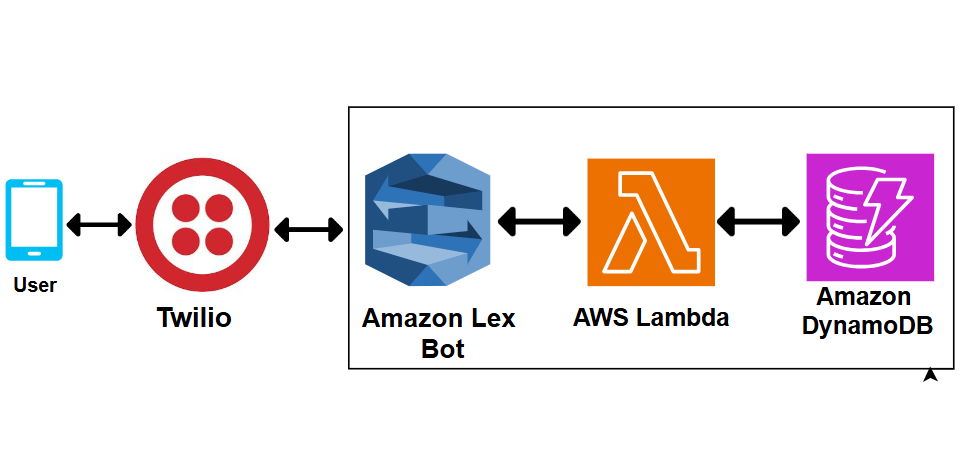
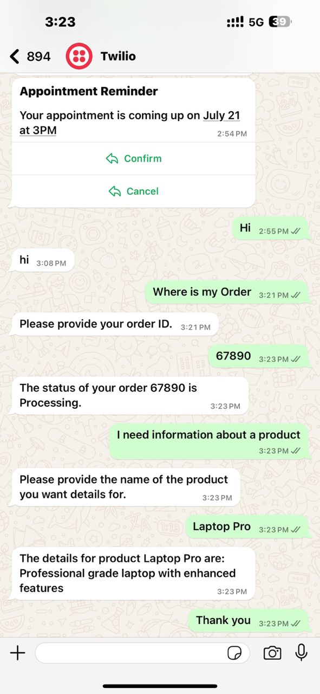

# Lex-Lambda-Twilio-Integration

This project integrates Amazon Lex, AWS Lambda, and Twilio to create a chatbot that interacts via WhatsApp.

## Architecture Overview

### Components
1. *Amazon Lex*: Used to build conversational interfaces (chatbots) that can interact with end-users.
2. *AWS Lambda*: Used to run the backend code that handles the logic for retrieving order statuses and product information from DynamoDB.
3. *Amazon DynamoDB*: A NoSQL database service used to store order statuses and product information.
4. *Twilio*: Used to enable communication between the chatbot and WhatsApp users.

### Architectural Flow
1. The user sends a message to the Twilio number from WhatsApp.
2. Twilio forwards the message to Amazon Lex.
3. Amazon Lex processes the message using defined intents and slots.
4. If necessary, Amazon Lex invokes an AWS Lambda function to fulfill the user's request.
5. The Lambda function retrieves data from DynamoDB and sends the response back to Lex.
6. Amazon Lex sends the response back to Twilio.
7. Twilio delivers the response to the user on WhatsApp.

### Architectural Diagram

## Deployment Steps

### 1. Twilio Account and Number
- Sign up for a Twilio account at [Twilio](https://www.twilio.com/).
- Obtain a Twilio phone number.

### 2. Create the Lex Bot, Intents, and Slots
- Go to the Amazon Lex console.
- Click "Create bot" and follow the steps to create a new bot.
- Name your bot (e.g., CustomerSupportBot).
- Select a language and a voice for your bot.

#### Creating Intents and Slots

##### OrderStatus Intent
1. Click on "Add intent" and select "Create intent".
2. Name the intent OrderStatus.
3. Under "Sample utterances", add phrases that users might say to trigger this intent:
   - "Where is my order"
   - "Track order {OrderID}"
   - "Check order status"
4. Under "Slots", click on "Add slot".
   - Slot name: OrderID
   - Slot type: AMAZON.Number
   - Prompt: "Please provide your order ID."
5. Click "Save Intent".
6. Click "Build" to build the bot with the newly added intent.

##### ProductInfo Intent
1. Click on "Add intent" and select "Create intent".
2. Name the intent ProductInfo.
3. Under "Sample utterances", add phrases that users might say to trigger this intent:
   - "Tell me more about {ProductName}"
   - "I need information on {ProductName}"
   - "What does {ProductName} do?"
4. Under "Slots", click on "Add slot".
   - Slot name: ProductName
   - Slot type: Create a new slot type ProductNames and add values such as "laptop", "tablet", "smartphone".
   - Prompt: "Please provide the name of the product you want details for."
5. Click "Save Intent".
6. Click "Build" to build the bot with the newly added intent.

#### Create a New Bot Version
1. Once you have added all the intents and slots, go to the "Versions" tab of your bot.
2. Click on "Create version".
3. Provide a description for the version (optional) and click "Create".

#### Create a Bot Alias
1. Go to the "Aliases" section of your bot.
2. Click on "Create alias".
3. Name the alias (e.g., ProdAlias).
4. Associate the alias with the version you just created.
5. Click "Save".

#### Select the Lambda Function in Alias Language Settings
1. In the "Aliases" section, click on the alias you just created (e.g., ProdAlias).
2. Click "Edit" in the "Alias language support" section.
3. Under "Lambda function - optional", select the Lambda function you created from the dropdown menu (e.g., OrderStatusHandler).
4. Click "Save".

### 3. Create the DynamoDB Tables
- Go to the Amazon DynamoDB console.
- Click "Create table".

#### CustomerOrders Table
- Table name: CustomerOrders
- Primary key: OrderID (Type: String)
- Click "Create".

#### ProductInfo Table
- Table name: ProductInfo
- Primary key: ProductName (Type: String)
- Click "Create".

##### Sample Data
- *CustomerOrders* table:
  - OrderID: 11223, Status: Delivered
  - OrderID: 67890, Status: Processing
- *ProductInfo* table:
  - ProductName: Laptop, Details: High performance laptop
  - ProductName: Tablet, Details: Lightweight tablet

### 4. Create and Deploy Lambda Function
- Go to the AWS Lambda console.
- Click "Create function".
- Name your function OrderStatusHandler.
- Choose "Author from scratch".
- Choose the runtime as Python 3.x.
- Click "Create function".

#### Add the Lambda Function Code
The Lambda function code used in this project is included in the lambda_function.py file in this repository.

### 5. Integrate Amazon Lex with Twilio
- Go to the Twilio console.
- Navigate to the "Phone Numbers" section.
- Select the Twilio number you want to use.
- In the "Messaging" section, set the "A MESSAGE COMES IN" webhook to the Amazon Lex endpoint URL.
- Save the changes.

### 6. Interact from WhatsApp to Amazon Lex Chat Bot
- Send a message from WhatsApp to the Twilio number you configured.
- The message should trigger the Lex bot and respond based on the intents and slots defined.

### 7. Deploy the Bot
- Go to the Amazon Lex console.
- Navigate to your bot.
- Click "Build" to deploy the bot with the latest changes.

## Achievements
- Successfully integrated Amazon Lex, AWS Lambda, and Twilio to create a WhatsApp chatbot.
- Implemented intents and slots in Amazon Lex for order status and product information queries.
- Deployed AWS Lambda function to handle backend logic and data retrieval from DynamoDB.
- Set up DynamoDB tables to store order statuses and product information.
- Configured Twilio to forward WhatsApp messages to Amazon Lex and respond back to users.

Here is a screenshot showing the bot in action on WhatsApp:

This image demonstrates the successful integration of Amazon Lex, AWS Lambda, and Twilio to enable a chatbot interaction via WhatsApp.

## Additional Resources
- Amazon Lex Documentation: [Amazon Lex](https://docs.aws.amazon.com/lex/)
- AWS Lambda Documentation: [AWS Lambda](https://docs.aws.amazon.com/lambda/)
- Twilio Documentation: [Twilio](https://www.twilio.com/docs/)

